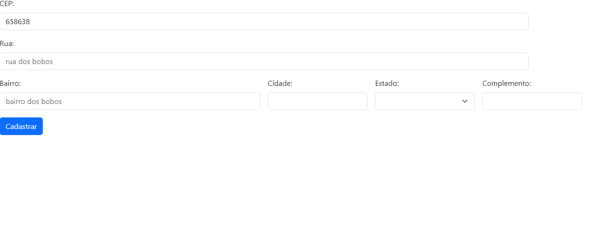

# INDÍCE
[ Projeto de Formulário para Cadastro de Endereço - Introdução]()   
[Funcionalidades](#funcionalidades)  
[Tecnologias utilizadas](#tecnologias-utilizadas)  
[Fontes consultadas](#fontes-consultadas)  
[Autores](#autores)  

# Projeto de Formulário para Cadastro de Endereço - Introdução

## Funcionalidades

### LIMPAR O FORMULÁRIO

### VERFICAR SE O CEP É VÁLIDO

### PREENCHER O FORMULÁRIO

## Tecnologias utilizadas
Neste projetos tivemos o uso de:
* HTML 5 
* JAVASCRIPT
* GIT 
* GITHUB
* BOOTSTRAP 5

## Fontes consultadas

## Autores
Sarah Ozeto, com a orientação do professor Leonardo Rocha.
