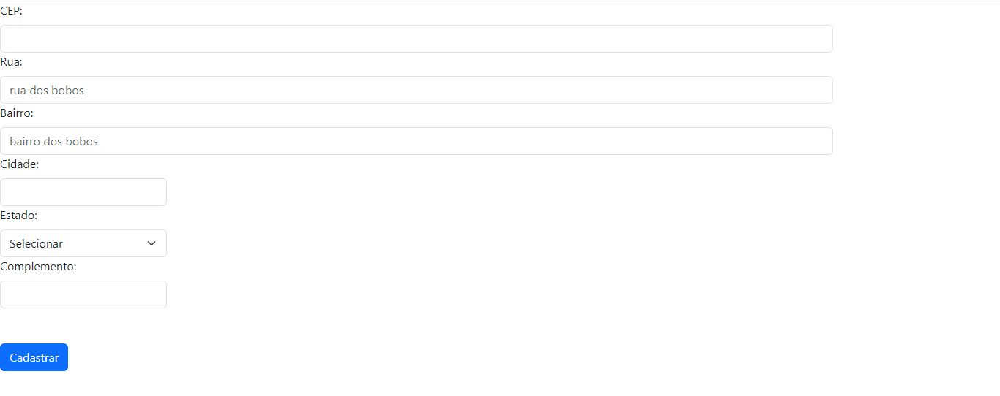

# INDÍCE
[ Projeto de Formulário para Cadastro de Endereço - Introdução](#projeto-de-formul%C3%A1rio-para-cadastro-de-endere%C3%A7o---introdu%C3%A7%C3%A3o)   
[Funcionalidades](#funcionalidades)  
[Tecnologias utilizadas](#tecnologias-utilizadas)  
[Fontes consultadas](#fontes-consultadas)  
[Autores](#autores)  

# Projeto de Formulário para Cadastro de Endereço - Introdução

Durante a aula aprendemos como validar o CEP usando o Arrow Function. Para praticar criamos um fomrulário de endereço que, quando o usuário preenche o CEP e este é válidado, automaticamente os outros campos são preenchidos. 

## Funcionalidades
Como dito anteriormente, o usuário preenche o CEP e, se ele for válido, todos os outros campos são preenchidos mas caso o CEP não exista ou não seja válido, o contrário acontece. Mas como isso foi feito e como acontece? Abaixo você verá as explicações de cada parte do código.

### VALIDANDO O CEP

### PREENCHER O FORMULÁRIO

### LIMPAR O FORMULÁRIO

## Tecnologias utilizadas
Neste projetos tivemos o uso de:
* HTML 5 
* JAVASCRIPT
* GIT 
* GITHUB
* BOOTSTRAP 5

## Fontes consultadas
[Acessando o webservice de CEP](https://viacep.com.br/)

## Autores
Sarah Ozeto, com a orientação do professor Leonardo Rocha.
