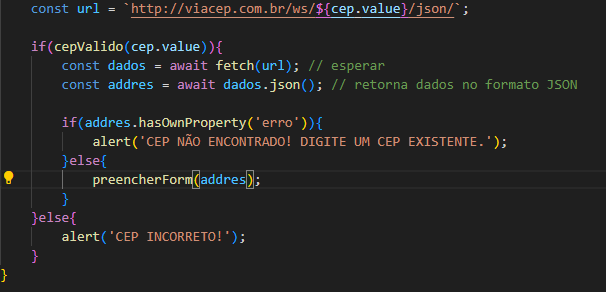

# INDÍCE
[ Projeto de Formulário para Cadastro de Endereço - Introdução](#projeto-de-formul%C3%A1rio-para-cadastro-de-endere%C3%A7o---introdu%C3%A7%C3%A3o)   
[Funcionalidades](#funcionalidades)  
[Tecnologias utilizadas](#tecnologias-utilizadas)  
[Fontes consultadas](#fontes-consultadas)  
[Autores](#autores)  

# Projeto de Formulário para Cadastro de Endereço - Introdução

Durante a aula aprendemos como validar o CEP usando o Arrow Function. Para praticar criamos um fomrulário de endereço que, quando o usuário preenche o CEP e este é válidado, automaticamente os outros campos são preenchidos. 

## Funcionalidades
Como dito anteriormente, o usuário preenche o CEP e, se ele for válido, todos os outros campos são preenchidos mas caso o CEP não exista ou não seja válido, o contrário acontece. Mas como isso foi feito e como acontece? Abaixo você verá as explicações de cada parte do código!

### VALIDANDO O CEP

Quando o usuário digitar, o código vai verificar se o o que foi digitado contém a quantidade de digitos corretos. De uma forma mais simplificada: funciona como um compartimento com nove entradas, o resultado apenas será aceito caso tenha a quantidade correta de digitos e, na segunda linha, especificamos que essa quantidade é oito e que deverá conter apenas números. Em outras palavras, é como se dissessemos "apenas será verdadeiro se o que for escrito tiver oito digitos e todos forem números".

Outro evento que acontece é que o código reconhece caso o usuário digitar um CEP inexistente. Para que isso aconteça foi feito uma espécie de ponte entre o nosso código e o site da viacep, usando o **fetch**, que possibilita fazer chamadas com APIs externas de formas simples e assíncronas. Após criarmos essa ligação, foi usado o **hasOwnProperty** para verificar se o que foi digitado existe ou não, ele verifica dentro da variável e depois retorna um alert dependendo do resultado.É como se o fetch começasse o trabalho e o hasOwnProperty terminasse. 

### LIMPAR E PREENCHER FORMULÁRIO

Quando o CEP for validado, ao passar de um campo para o outro, o formulário limpa antes de preencher com novas informações e isso ocorre graças ao **addEventListener('focusout')**. Explicando brevemente nós adicionamos um evento e o **focusout** atua quando o foco saí da linha selecionada, então ele só vai executar esse comando quando o foco sair da linha, enquanto a linha estiver selecionada nada vai acontecer.

Após limpar, o formulário preenche com novas informações e o mesmo comando anterior faz essa tarefa.

## Tecnologias utilizadas
Neste projetos tivemos o uso de:
* HTML 5 
* JAVASCRIPT
* GIT 
* GITHUB
* BOOTSTRAP 5

## Fontes consultadas
[Acessando o webservice de CEP](https://viacep.com.br/)

## Autores
Sarah Ozeto, com a orientação do professor Leonardo Rocha.
